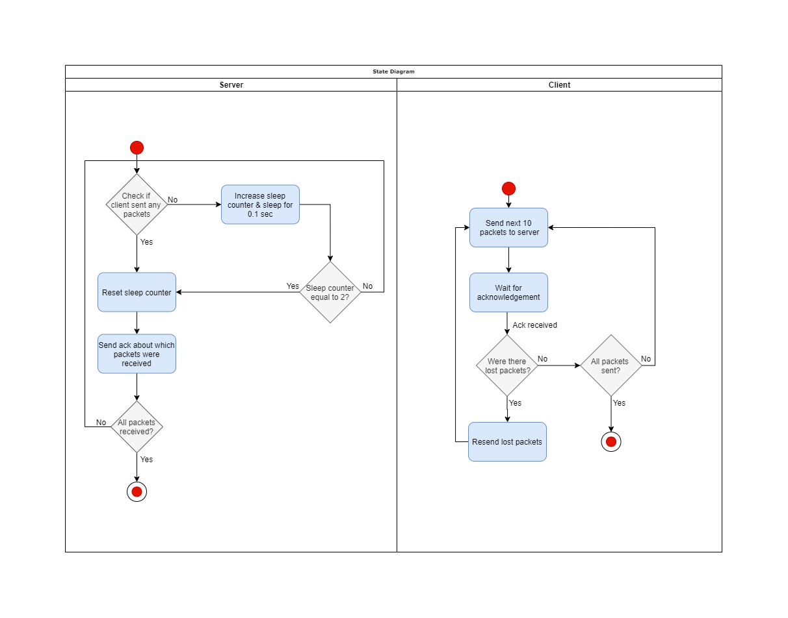

# Reliable UDP File Transfer
This project aims to demonstrate a reliable UDP transfer over sockets written in C language for Linux. The build process is supported through CMake to make it more efficient. The following requirements were kept in mind while imbuing reliability to UDP:
- Reordering via sequence numbers at receiver.
- Selective Repeat
- Window Size of 10 UDP Segments through Stop N Wait

## Compile
- CMake (Requires CMake Version >=3.10)
```
cmake .
make
```
- GCC
```
gcc client_udp.c -o client
gcc server_udp.c -o server
```

Both options will output two executable files:
- server
- client

## Run
- Manually
```
./server 8080
./client 8080
```
- Auto (Runs on port 8080)
```
./run.sh
```

## State Diagram

